```mermaid
graph TD
    User((User)) <--> Manager
    
    subgraph "AgentScope Ecosystem"
        direction TB
        %% 注æ„：下方节点文本都加上了åŒå¼•å· ""
        Perception["Perception Agent<br/>(L0-L1 Vision)"] -->|Stream| Aggregator["Aggregator Agent<br/>(L2 Events)"]
        Aggregator -->|Update| Manager["Memory Manager<br/>(L3-L4 Summaries)"]
        
        Gardener["Gardener Agent<br/>(Maintenance Critic)"] -.->|Prune/Edit| Manager
        Gardener -.->|Re-Perceive| Perception
    end
    
    Manager <--> DB[("Vector & Graph DB")]
```

# Active-H-EMV: 基于 AgentScope 的长时序机器人主动记忆系统

<div align="center">


<p>
  <a href="#intro">项目简介</a> •
  <a href="#arch">系统架构</a> •
  <a href="#install">安装说明</a> •
  <a href="#start">快速开始</a> •
  <a href="#cite">引用</a>
</p>

</div>

## <span id="intro">📖 项目简介 (Introduction)</span>

**Active-H-EMV** 是一个面向具身智能（Embodied AI）的长时序情景记忆系统。本项目作为本科毕业设计，旨在解决传统 H-EMV (Hierarchical Episodic Memory Verbalization) 算法在长期运行中面临的**存储无限膨胀**与**视觉误差累积**两大难题。

本项目创新性地将 **AgentScope** 多智能体协作框架引入记忆管理，提出了一种 **“双轨制”** 融合方案：

1.  **主动遗忘机制 (Active Forgetting):** 基于信息熵与艾宾浩斯曲线的效用评价算法，自动修剪低价值记忆。
2.  **追溯性记忆编辑 (Retroactive Editing):** 基于人机回环（Human-in-the-loop）反馈，修正历史视觉误差并阻断错误传播。

> **致谢:** 本项目核心算法基于 KIT 的 [H-EMV](https://github.com/lbaermann/hierarchical-emv) 进行改进，并构建于 [AgentScope](https://github.com/modelscope/agentscope) 框架之上。

-----

## 🚀 核心特性 (Key Features)

| 特性 | 原始 H-EMV | **Active-H-EMV (本项目)** |
| :--- | :--- | :--- |
| **架构模式** | 单体脚本，串行处理 | **AgentScope 分布式多智能体** |
| **存储策略** | 只增不减 (Append-only) | **基于效用的动态修剪 (Pruning)** |
| **记忆修正** | 不支持，误差永久固化 | **支持追溯性编辑与级联更新** |
| **并发能力** | 低 (线性阻塞) | **高 (异步感知/并行检索)** |
| **数据结构** | 静态树 | **带生命周期的动态图谱** |

-----

## <span id="arch">🏗️ 系统架构 (Architecture)</span>

本系统将 H-EMV 的层级结构映射为 AgentScope 中的独立智能体生态：



  * **🕵️ Perception Agent:** 负责 L0/L1 层数据处理，集成 YOLO-World + CLIP。
  * **📝 Aggregator Agent:** 负责 L2 事件切分与自然语言描述生成。
  * **🧠 Memory Manager:** 系统“大脑”，负责 L3/L4 递归摘要生成及用户检索路由。
  * **✂️ Gardener Agent (创新核心):** 独立后台进程，执行遗忘策略与错误修正。

-----

## 🔬 算法原理 (Algorithm)

### 自适应遗忘效用函数

我们定义节点 $n$ 在时刻 $t$ 的保留效用 $U(n,t)$ 为：

$$U(n, t) = \underbrace{\left( \alpha \cdot \hat{A}(n) + \beta \cdot S(n) + \gamma \cdot I(n) \right)}_{\text{Intrinsic Value}} \cdot \underbrace{e^{-\lambda(t - \tau_{last})}}_{\text{Time Decay}} $$ 

* $\hat{A}(n)$: 访问热度 (Log-scaled access frequency)
* $S(n)$: 语义显著性 (LLM-scored significance)
* $I(n)$: 信息密度 (Information density)
* $\lambda$: 动态调节的遗忘速率

-----

## <span id="install">🛠️ 安装说明 (Installation)</span>

### 前置要求

* Python 3.10+
* CUDA 11.8+ (推荐用于本地 VLM 推理)
* API Keys (OpenAI/DashScope)

### 步骤

1.  **克隆仓库**

```bash
git clone https://github.com/your-username/active-h-emv.git
cd active-h-emv
```

2.  **安装依赖**

```bash
pip install -r requirements.txt
```

3.  **配置 AgentScope**
在 `configs/model_configs.json` 中填入你的模型 API Key：

```json
[
{
"model_type": "openai_chat",
"config_name": "gpt-4o",
"api_key": "sk-...",
"organization": "..."
}
]
```

-----

## <span id="start">⚡ 快速开始 (Quick Start)</span>

### 1\. 启动全流程模拟

运行主流水线，该脚本将模拟：视频流摄入 -\> 记忆生成 -\> 自动遗忘 -\> 用户问答。

```bash
python main_pipeline.py --config configs/default.yaml
```

### 2\. 单独测试 Gardener (遗忘机制)

生成模拟数据树并执行修剪测试：

```bash
python tests/test_gardener.py --prune_threshold 0.3
```

-----

## 📂 目录结构 (File Structure)

```text
Active-H-EMV/
├── agents/                 # AgentScope 智能体定义
│   ├── perception_agent.py # 感知与入库
│   ├── memory_manager.py   # 记忆编排与检索
│   └── gardener_agent.py   # [Core] 遗忘与编辑逻辑
├── core/                   # 核心算法库
│   ├── h_emv/              # 修改版 H-EMV 数据结构
│   │   ├── node.py         # 包含 utility_score 的节点类
│   │   └── tree.py         # 支持修剪的树结构
│   └── utils/              # 工具函数 (Math, Logging)
├── configs/                # 配置文件
├── data/                   # 示例数据与数据库连接
├── main_pipeline.py        # 程序入口
└── README.md
```

-----

## 📅 开发计划 (Roadmap)

- [x] **Phase 1:** 基于 AgentScope 复现 H-EMV 基础读写链路。
- [x] **Phase 2:** 实现基于 Utility Function 的主动遗忘机制 (`GardenerAgent`)。
- [ ] **Phase 3:** 实现基于用户反馈的追溯性记忆编辑 (Retroactive Editing)。
- [ ] **Phase 4:** 在 TEACh 数据集上进行长时序 (Long-horizon) 评估。
- [ ] **Phase 5:** 接入实体机器人（如 ROS2 接口）进行实机测试。

-----

## <span id="cite">🤝 引用 (Citation)</span>

如果你在研究中使用了本项目，请引用 H-EMV 原文及本项目：

```bibtex
@inproceedings{baermann2024hemv,
title={Hierarchical Episodic Memory Verbalization for Life-Long Robot Experiences},
author={Baermann, Lukas and others},
booktitle={ICRA},
year={2024}
}

@misc{active-h-emv-2025,
author = {Your Name},
title = {Active-H-EMV: Long-Term Robot Memory System based on AgentScope},
year = {2025},
publisher = {GitHub},
journal = {GitHub repository},
howpublished = {\url{https://github.com/your-username/active-h-emv}}
}
```
